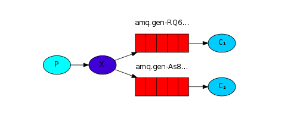

# 一、安装部署

# 二、通讯方式
## 2.1 "Hello World!"

- 一个生产者
- 一个消费者
- 一个队列
- 使用默认交换机
- 默认路由（为队列名）
## 2.2 Work queues

- 一个生产者
- 两个消费者（进行轮询消费，每个消息只会被成功的消费一次）
- 一个队列
- 默认交换机
- 默认路由

## 2.3 Publish/Subscribe

发布/订阅模式（FANOUT分裂模式）
- 一个生产者
- 一个FUNOUT类型交换机（这种模式交换机和队列直接绑定，不需要RoutingKey）
- 两个队列
- 两个消费者
## 2.4 Routing

DIRECT直接模式
- 一个生产者
- 一个DIRECT模式交换机（交换机通过不同的RoutingKey绑定队列）
- 两个队列（一个队列可以绑定多个路由规则，RoutingKey如果没有对应的队列则会被丢弃）
- 两个消费者
## 2.5 Topics

TOPIC主题模式
- 一个生产者
- 一个TOPIC类型交换机（通过不同的路由规则绑定队列）
- 两个队列
- 两个消费者

（注意：需要以aaa.bbb.ccc..方式编写routingkey ,其中有两个特殊字符:*(相当于占位符)，#(相当通配符)）
## 2.6 RPC

Client/Server RPC模式，通过队列进行解耦
Client 发送请求消息到达 请求消息队列，并且监听 响应消息队列
Server 监听请求消息队列，并且回复响应信息 到响应消息队列
整个流程需要携带两个参数：
1. replyTo： 告知Server将相应信息放到哪个队列 （指定响应队列）
2. correlationId：告知Server发送相应消息时，需要携带位置标示来告知Client响应的信息（响应消息对应请求消息）

# 三、死信队列和延迟交换机

# 四、消息可靠性

# 五、集群高可用