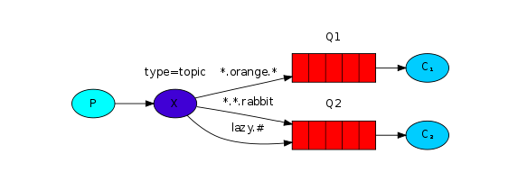

# 一、安装部署

# 二、通讯方式(操作RabbitMQ API)
结构Maven项目，导入Pom依赖：
```xml
    <dependency>
        <groupId>com.rabbitmq</groupId>
        <artifactId>amqp-client</artifactId>
        <version>5.9.0</version>
    </dependency>
    <dependency>
        <groupId>junit</groupId>
        <artifactId>junit</artifactId>
        <version>4.13.1</version>
    </dependency>
```
## 2.1 "Hello World!"


- 一个生产者
- 一个消费者
- 一个队列
- 使用默认交换机
- 默认路由（为队列名）
## 2.2 Work queues


- 一个生产者
- 两个消费者（进行轮询消费，每个消息只会被成功的消费一次）
- 一个队列
- 默认交换机
- 默认路由

## 2.3 Publish/Subscribe


发布/订阅模式（FANOUT分裂模式）

- 一个生产者
- 一个FUNOUT类型交换机（这种模式交换机和队列直接绑定，不需要RoutingKey）
- 两个队列
- 两个消费者
## 2.4 Routing


DIRECT直接模式

- 一个生产者
- 一个DIRECT模式交换机（交换机通过不同的RoutingKey绑定队列）
- 两个队列（一个队列可以绑定多个路由规则，RoutingKey如果没有对应的队列则会被丢弃）
- 两个消费者
## 2.5 Topics


TOPIC主题模式

- 一个生产者
- 一个TOPIC类型交换机（通过不同的路由规则绑定队列）
- 两个队列
- 两个消费者

（注意：需要以aaa.bbb.ccc..方式编写routingkey ,其中有两个特殊字符:*(相当于占位符)，#(相当通配符)）
## 2.6 RPC


Client/Server RPC模式，通过队列进行解耦

Client 发送请求消息到达 请求消息队列，并且监听 响应消息队列

Server 监听请求消息队列，并且回复响应信息 到响应消息队列

整个流程需要携带两个参数：
1. replyTo： 告知Server将相应信息放到哪个队列 （指定响应队列）
2. correlationId：告知Server发送相应消息时，需要携带位置标示来告知Client响应的信息（响应消息对应请求消息）

# 三、RabbitMQ整合Spring
## 3.1 导入依赖
```pom
     <parent>
        <groupId>org.springframework.boot</groupId>
        <artifactId>spring-boot-starter-parent</artifactId>
        <version>2.2.2.RELEASE</version>
    </parent>

    <dependency>
        <groupId>org.springframework.boot</groupId>
        <artifactId>spring-boot-starter-test</artifactId>
    </dependency>
    <dependency>
        <groupId>org.springframework.boot</groupId>
        <artifactId>spring-boot-starter-amqp</artifactId>
    </dependency>
```
## 3.2 application.yml配置RabbitMQ信息
```yml
spring:
  rabbitmq:
    host: 172.16.98.100
    port: 5672
    username: admin
    password: admin
    virtual-host: /
```
## 3.3 配置类声明交换机、队列和绑定
```Java
package com.lsh.config;

import org.springframework.amqp.core.*;
import org.springframework.context.annotation.Bean;
import org.springframework.context.annotation.Configuration;

/**
 * @author ：LiuShihao
 * @date ：Created in 2022/3/15 11:36 下午
 * @desc ：配置类声明交换机、队列和绑定
 */
@Configuration
public class RabbitMQConfig {

    /**Topic类型交换机*/
    public static final String TOPIC_EXCHANGE_NAME = "boot-exchange";

    /**Queue队列名*/
    public static final String QUEUE_NAME = "boot-queue";

    /**RoutingKey 路由Key*/
    public static final String ROUTING_KEY = "*.black.*";

    /**
     * 声明交换机: 在SpringBoot项目中，直接通过ExchangeBuilder来构造交换机
     * @return org.springframework.amqp.core.Exchange
     */
    @Bean
    public Exchange exchange(){
        // => channel.DeclareExchange
        Exchange exchange = ExchangeBuilder.topicExchange(TOPIC_EXCHANGE_NAME).build();
        return exchange;
    }

    /**
     * 声明队列：在SpringBoot中，通过QueueBuilder.durable(队列名)来构造队列
     * @return
     */
    @Bean
    public Queue queue(){
        Queue queue = QueueBuilder.durable(QUEUE_NAME).build();
        return queue;
    }

    /**
     * 声明绑定：在SpringBoot项目中，通过BindingBuilder.bind(队列).to(交换机).with(路由Key)构造绑定
     * @param exchange 交换机
     * @param queue    队列
     * @return
     */
    @Bean
    public Binding binding(Exchange exchange,Queue queue){
        Binding binding = BindingBuilder.bind(queue).to(exchange).with(ROUTING_KEY).noargs();
        return binding;
    }

}

```
# 四、消息可靠性

# 五、集群高可用